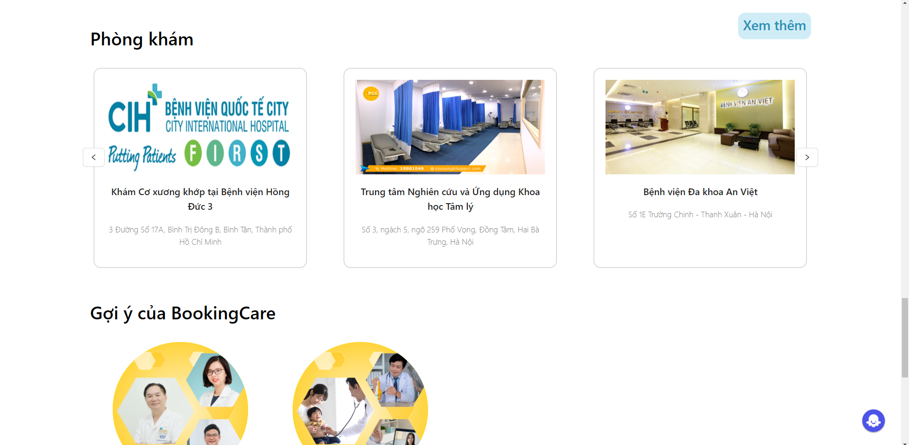

# WEBSITE HỖ TRỢ QUẢN LÝ VÀ ĐẶT LỊCH CHO CÁC PHÒNG KHÁM

### Các công nghệ sử dụng:

ReactJS, Node.js, Express.js, MongoDB, Boostrap

### Môi trường cài đặt và công nghệ sử dụng:

Website được xây dựng trên nền tảng ReactJS và NodeJS trong môi trường phần mềm Visual Studio Code. Các công nghệ sử dụng bao gồm:

-   Frontend:

    -   ReactJS: Sử dụng cả React Hooks và React Class Components để xây dựng giao diện người dùng. ReactJS giúp xây dựng các giao diện động và dễ dàng quản lý trạng thái.

    -   Material-UI: Thư viện giao diện người dùng giúp xây dựng các thành phần đẹp mắt và dễ sử dụng với thiết kế hiện đại.

    -   HTML, SCSS, Javascript: SCSS được sử dụng để viết mã CSS một cách có cấu trúc và dễ bảo trì, trong khi JavaScript được dùng cho các logic xử lý trên client-side.

    -   Coze AI: Công nghệ trí tuệ nhân tạo được tích hợp vào frontend để hỗ trợ tư vấn bệnh nhân. Coze AI sẽ cung cấp các gợi ý thông minh, tư vấn các câu hỏi về sức khỏe, và hỗ trợ người dùng trong việc tìm kiếm thông tin y tế. Chatbot AI chỉ hoạt động ở phần giao diện người dùng (frontend), giúp bệnh nhân nhanh chóng nhận được các phản hồi về vấn đề sức khỏe mà họ đang gặp phải.

-   Backend:

    -   NodeJS: Được sử dụng để xây dựng server-side của ứng dụng, với khả năng xử lý đồng thời rất hiệu quả.

    -   ExpressJS: Framework hỗ trợ việc xây dựng các API RESTful đơn giản và dễ hiểu trên nền tảng NodeJS.

    -   RESTful API: Backend triển khai các API RESTful để frontend và backend giao tiếp với nhau thông qua các HTTP requests (GET, POST, PUT, DELETE).

-   Cơ sở dữ liệu:

    -   MongoDB: Dùng để lưu trữ dữ liệu ứng dụng. MongoDB là cơ sở dữ liệu NoSQL, phù hợp với mô hình dữ liệu linh hoạt và mở rộng.

    -   Mongoose: Là thư viện ODM (Object Data Modeling) được sử dụng để giao tiếp với MongoDB. Mongoose giúp dễ dàng tạo và quản lý các schema và model, giúp thao tác với dữ liệu MongoDB trở nên thuận tiện và an toàn.

    -   Schema: Định nghĩa cấu trúc của các document trong MongoDB.

    -   Model: Các đối tượng tương ứng với các schema trong cơ sở dữ liệu, giúp thực hiện các thao tác CRUD (Create, Read, Update, Delete).

### Về tính năng của hệ thống:

-   Đăng ký và quản lý tài khoản: Người dùng có thể đăng ký, cập nhật thông tin, đổi mật khẩu và khôi phục mật khẩu qua email, quản trị viên có thể quản lý tài khoản (thêm, sửa, xóa, khóa/mở khóa).

-   Quản lý lịch hẹn khám bệnh: Người dùng xem và đặt lịch khám với bác sĩ, hệ thống gửi email xác nhận lịch hẹn và kết quả khám sau khi hoàn tất.

-   Quản lý bệnh nhân và thông tin khám bệnh: Bệnh nhân xem lịch sử khám bệnh, bác sĩ cập nhật kết quả khám và tạo hóa đơn.

-   Quản lý phòng khám và chuyên khoa: Quản trị viên quản lý thông tin phòng khám và chuyên khoa (thêm, sửa, xóa).

-   Phân quyền người dùng: Quản trị viên có toàn quyền quản lý hệ thống, bác sĩ quản lý bệnh nhân và lịch làm việc, bệnh nhân chỉ xem được thông tin cá nhân và lịch sử khám.

-   Tích hợp chatbot hỗ trợ: Chatbot tư vấn bệnh nhân về quy trình khám, tư vấn sức khỏe và hướng dẫn đặt lịch.

-   Gửi email thông báo: Email xác nhận lịch hẹn gửi ngay sau khi đặt lịch thành công và email tóm tắt kết quả khám gửi sau khi hoàn tất khám.

-   Gửi câu hỏi cho bác sĩ và nhận câu trả lời qua email: Người dùng có thể gửi câu hỏi đến bác sĩ thuộc chuyên khoa thông qua hệ thống, và nhận được câu trả lời từ bác sĩ qua email.

### GIAO DIỆN WEBSITE

-   Giao diện trang chủ

-   Giao diện quản lý của bác sĩ

-   Giao diện quản lý của quản trị viên

# 

### Link dự án

Link FE: https://github.com/thquan0308/React-QLPK

Link FE quản lý doctor:https://github.com/thquan0308/React-QLPK-doctor

Link BE: https://github.com/thquan0308/NodeJS-QLPK

### Các bước cài đặt:

1. Cài đặt ứng dụng ReactJS: Gõ lệnh
   npm install
   npm start

2. Cài đặt ứng dụng ReactJS_doctor: Gõ lệnh
   npm install
   npm start

3. Các phiên bản sử dụng
   Node version v22.11.0
   Npm version 10.9.0
